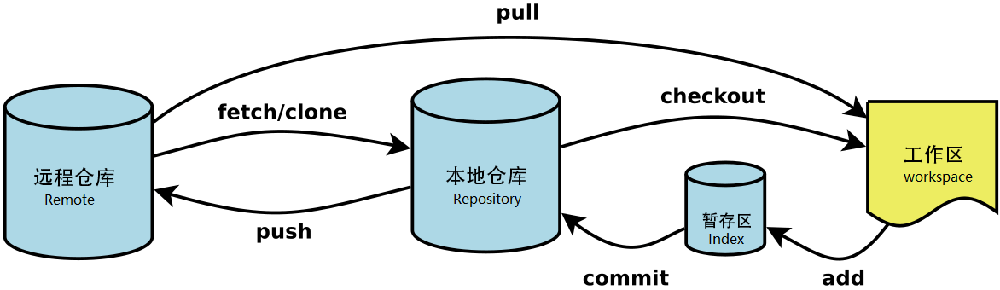

<span id="顶部">

# Git操作说明
---

<span id="目录">

## 目录
+ [一、专用名词](#one)
+ [二、关于4个区的常用操作命令](#two)
+ [三、Git配置操作命令](#three)
+ [四、工作区上的操作命令（Workspace）](#four)
  + [1. 新建本地仓库](#four1)
  + [2. 提交操作](#four2)
  + [3. 撤销操作](#four3)
  + [4. 更新操作](#four4)
  + [5. 查询操作](#four5)
+ [五、暂存区上的操作命令](#five)
  + [1. 提交文件到版本库](#five1)
  + [2. 查看信息](#five2)
  + [3. 打标签](#five3)
  + [4. 分支管理](#five4)
+ [六、本地仓库上的操作](#six)
+ [七、忽略文件.gitignore](#seven)
+ [八、关于团队协作的4种git工作流](#eight)
  + [1. 集中式工作流](#eight1)
  + [2. 功能分支工作流](#eight2)
  + [3. Gitflow工作流](#eight3)
  + [4. Forking工作流](#eight4)

<span id="one">

### 一、专用名词
版本库：`.git文件夹`，里面包含两部分：暂存区和本地仓库；<br>

| 名词 | 解释 |
| :--- | :--- |
| Workspace | 工作区，本地电脑存放项目文件的地方 |
| Index/Stage | 暂存区，存在于`.git文件夹`，存放临时文件，用来准备一个提交，但可以不用把工作目录中所有的修改内容都包含进来。这样你可以创建一个高度聚焦的提交，尽管你本地修改很多内容。使用add命令之后，将工作区的改动文件添加到此处 |
| 本地仓库 | 存在于`.git文件夹`，是各个分支存储处，包括git自动创建的master分支，使用commit命令可以将暂存区中的文件添加到本地仓库中 |
| 远程仓库 | 存在于git服务器 |



---

<span id="two">

### 二、关于4个区的常用操作命令 &#8195;&#8195;&#8195;&#8195;&#8195;&#8195;&#8195;&#8195;&#8195;&#8195;&#8195;&#8195;[回到目录](#目录)
| 命令 | 作用 |
| :--- | :--- |
| `git add [file]或.` | 将改动从工作区提交到暂存区 |
| `git commit -m "提交说明"` | 将暂存区改动提交到本地仓库 |
| `git pull` | 拉取远程仓库改动至工作区 |
| `先git fetch`，然后`git merge` | 拉取远程仓库改动至本地仓库，然后合并工作区 |
| `git push origin master` | 一般使用简单写法```git push```：推送本地仓库改动至远程仓库 |

---

<span id="three">

### 三、Git配置操作命令 &#8195;&#8195;&#8195;&#8195;&#8195;&#8195;&#8195;&#8195;&#8195;&#8195;&#8195;&#8195;[回到目录](#目录)
git的配置文件为```.gitconfig```，它可以在用户主目录下（全局配置），也可以在项目目录下（项目配置）。

| 命令 | 作用 |
| :--- | :--- |
| `git config --list` | 列出当前配置 |
| `git config --local --list` | 列出repository配置 |
| `git config --global --list` | 列出全局配置 |
| `git config --system --list` | 列出系统配置 |
| `git config --global user.name "your name"` | 配置用户名 |
| `git config --global user.email "youremail@github.com"` | 配置用户邮箱 |
| `git config --global user.password "your password"` | 配置用户密码 |
| `git config --global color.ui auto` | 配置git命令输出为彩色的 |
| `git config --global core.editor vi` | 配置git使用的文本编辑器 |
| `git config --global merge.tool vimdiff` | 配置解决冲突时使用哪种差异分析工具，比如要使用vimdiff |

---

<span id="four">

### 四、工作区上的操作命令（Workspace）&#8195;&#8195;&#8195;&#8195;&#8195;&#8195;&#8195;&#8195;&#8195;&#8195;&#8195;&#8195;[回到目录](#目录)

<span id="four1">

1. 新建本地仓库

| 命令 | 作用 |
| :--- | :--- |
| `git init` | 在当前目录新建一个Git代码库 |
| `git init [project-name]` | 新建一个目录，将其初始化为Git代码库 |
| `git clone [url]` | 下载一个项目和它的整个代码历史 |
| `git clone [url] [projec name]` | 克隆远程库，并且重命名项目名称 |

---

<span id="four2">

2. 提交操作  &#8195;&#8195;&#8195;&#8195;&#8195;&#8195;&#8195;&#8195;&#8195;&#8195;&#8195;&#8195;[回到目录](#目录)

| 命令 | 作用 |
| :--- | :--- |
| `git add .` | 提交工作区所有文件到暂存区 |
| `git add [file1] [file2] ...` | 提交工作区中指定文件到暂存区 |
| `git add [dir]` | 提交工作区中某个文件夹中所有文件到暂存区（包括子目录） |

<span id="four3">

3. 撤销操作  &#8195;&#8195;&#8195;&#8195;&#8195;&#8195;&#8195;&#8195;&#8195;&#8195;&#8195;&#8195;[回到目录](#目录)

| 命令 | 作用 |
| :--- | :--- |
| `git rm [file1] [file2] ...` | 删除工作区文件，并且也从暂存区删除对应文件的记录 |
| `git rm --cached [file]` | 从暂存区中删除文件，但是工作区依然还有该文件 |
| `git reset HEAD [file]...` | 取消暂存区已经暂存的文件 |
| `git checkout --[file]` | 当改乱了工作区某个文件的内容，而且尚未进行add命令，想直接丢弃工作区的修改时使用此命令 |
| `git stash` | 隐藏当前变更，以便能够切换分支 |
| `git stash list` | 查看当前所有的储藏 |
| `git stash apply` | 应用最新的储藏 |
| `git stash apply stash@{0}` | 恢复指定的stash（0代表第一个） |
| `git stash apply --index` | 重新应用被暂存的变更，使用apply命令只是应用储藏，而内容仍然还在栈上，需要移除指定的储藏 |
| `git stash drop stash{0}` | 移除指定的储藏 |
| `git stash pop` | 恢复储藏，并删除stash内容 |

<span id="four4">

4. 更新操作  &#8195;&#8195;&#8195;&#8195;&#8195;&#8195;&#8195;&#8195;&#8195;&#8195;&#8195;&#8195;[回到目录](#目录)

| 命令 | 作用 |
| :--- | :--- |
| `git mv [file-original] [file-renamed]` | 重命名文件，并将已改名文件提交到暂存区 |

<span id="four5">

5. 查询操作  &#8195;&#8195;&#8195;&#8195;&#8195;&#8195;&#8195;&#8195;&#8195;&#8195;&#8195;&#8195;[回到目录](#目录)

| 命令 | 作用 |
| :--- | :--- |
| `git status` | 查询当前工作区所有文件的状态 |
| `git diff` | 比较工作区中当前文件和暂存区之间的差异，也就是修改之后还没有暂存的内容 |
| `git diff [file-name]` | 指定文件在工作区和暂存区上差异比较 |

---

<span id="five">

### 五、暂存区上的操作命令&#8195;&#8195;&#8195;&#8195;&#8195;&#8195;&#8195;&#8195;&#8195;&#8195;&#8195;&#8195;[回到目录](#目录)

<span id="five1">

1. 提交文件到版本库

| 命令 | 作用 |
| :--- | :--- |
| `git commit -m [commit info]` | 将暂存区的改动提交到本地仓库，每次提交都会产生一个commit id |
| `git commit [file1] [file2] ... -m [commit info]` | 提交暂存区的指定文件到本地仓库，每次提交都会产生一个commit id |
| `git commit -a` | 将所有已经使用git管理过的文件暂存后一并提交至本地仓库，跳过add到暂存区的过程，每次提交都会产生一个commit id |
| `git commit --amend` | 提交文件时，发现漏掉几个文件，或者注释写错了，可以撤销上一次提交，即amend提供对最后一次commit的反悔，但是如果已经push过了，那么其历史最后一次，永远也不能修改了 |
| `git rebase -i HEAD~3` | 表示要修改当前版本的倒数第三次状态 |

<span id="five2">

2. 查看信息  &#8195;&#8195;&#8195;&#8195;&#8195;&#8195;&#8195;&#8195;&#8195;&#8195;&#8195;&#8195;[回到目录](#目录)

| 命令 | 作用 |
| :--- | :--- |
| `git diff --cached` | 比较暂存区与上一版本的差异 |
| `git diff <file-name> --cached` | 指定文件在暂存区和本地仓库的不同 |
| `git log` | 查看提交历史 |
| `git log -p -2` | 参数-p展开每次提交的内容差异，用-2显示最近的两次更新 |
| `git reflog` | 用来记录每一次命令，即显示整个本地仓储的commit, 包括所有branch的commit, 甚至包括已经撤销的commit, 只要HEAD发生了变化, 就会在reflog里面看得到. git log只包括当前分支的commit |

<span id="five3">

3. 打标签  &#8195;&#8195;&#8195;&#8195;&#8195;&#8195;&#8195;&#8195;&#8195;&#8195;&#8195;&#8195;[回到目录](#目录)

| 命令 | 作用 |
| :--- | :--- |
| `git tag` | 列出现在所有的标签 |
| `git tag v1.5` | 创建一个轻量级标签的话，就直接使用git tag命令即可，连-a,-s以及-m选项都不需要，直接给出标签名字即可 |
| `git tag -l "v1.4.2.*"` | 使用特定的搜索模式列出符合条件的标签，例如：这个命令是只对1.4.2系列的版本感兴趣 |
| `git tag -a v1.4 -m "my version 1.4"` | 创建一个含附注类型的标签，需要加-a参数 |
| `git show v1.4` | 使用git show命令查看相应标签的版本信息，并连同显示打标签时的提交对象 |
| `git tag -s v1.5 -m "my signed 1.5 tag"` | 如果有自己的私钥，可以使用GPG来签署标签，只需要在命令中使用-s参数 |
| `git tag -v v1.5` | 验证已签署的标签 |
| `git push origin v1.5` | 将标签推送到远程仓库中 |
| `git push origin --tags` | 将本地所有的标签全部推送到远程仓库中 |

<span id="five4">

4. 分支管理  &#8195;&#8195;&#8195;&#8195;&#8195;&#8195;&#8195;&#8195;&#8195;&#8195;&#8195;&#8195;[回到目录](#目录)

| 命令 | 作用 |
| :--- | :--- |
| `git branch [branch-name]` | 创建分支 |
| `git checkout [branch-name]` | 从当前所处的分支切换到其他分支 |
| `git checkout -b [branch-name]` | 新建并切换到新建分支上 |
| `git push origin local_branch:remote_branch` | 创建远程分支，建立在本地分支的基础上 |
| `git branch -d [branch-name]` | 删除分支 |
| `git merge [branch-name]` | 将当前分支与指定分支进行合并 |
| `git branch` | 显示本地仓库的所有分支 |
| `git branch -v` | 查看各个分支最后一个提交对象的信息 |
| `git branch --merged` | 查看哪些分支已经合并到当前分支 |
| `git branch --no-merged` | 查看当前哪些分支还没有合并到当前分支 |
| `git merge [remote-name]/[branch-name]` | 把远程分支合并到当前分支。<br>如果是单线的历史分支不存在任何需要解决的分歧，只是简单的将HEAD指针前移，所以这种合并过程可以称为快进（Fast forward），而如果是历史分支是分叉的，会以当前分叉的两个分支作为两个祖先，创建新的提交对象；如果在合并分支时，遇到合并冲突需要人工解决后，再才能提交 |
| `git checkout -b [local_branch-name] [origin-name]/[remote_branch-name]` | 在远程分支的基础上创建新的本地分支，而后便可拉取该分支代码 |
| `git pull` | 在跟踪分支上，拉取远程仓库的变化，并与本地分支合并 |
| `git rebase` | 可以对某一段线性提交历史进行编辑、删除、复制、粘贴，可以把本地未push的分叉提交历史整理成直线。<br>使用rebase操作应该遵循的原则是：一旦分支中的提交对象发布到公共仓库，就千万不要对该分支进行rebase操作。 |
| `git rebase -i  [startpoint]  [endpoint]` | -i的意思是--interactive，即弹出交互式的界面让用户编辑完成合并操作，[startpoint]和[endpoint]则指定了一个编辑区间，如果不指定[endpoint]，则该区间的终点默认是当前分支HEAD所指向的commit(注：该区间指定的是一个前开后闭的区间)。<br>如：`git rebase -i 36224db`或`git rebase -i HEAD~3`<br> |
| `git rebase [rebase-branch] [branch-name]` | 如`git rebase master server`，将特性分支server提交的改变在基底分支master上重演一遍 |
| `git rebase [startpoint] [endpoint] --onto [branchName]` | 即将某一段commit粘贴到另一个分支上。<br>[startpoint]和[endpoint]仍然和上一个命令一样指定了一个编辑区间(前开后闭)，--onto的意思是要将该指定的提交复制到哪个分支上 |
|'git branch --set-upstream-to=origin/remotebranch localbranch'|将远程分支与本地分支建立关联|
---

<span id="six">

### 六、本地仓库上的操作&#8195;&#8195;&#8195;&#8195;&#8195;&#8195;&#8195;&#8195;&#8195;&#8195;&#8195;&#8195;[回到目录](#目录)

| 命令 | 作用 |
| :--- | :--- |
| `git remote` | 查看本地仓库关联的远程仓库 |
| `git remote add [remote-name] [url]` | 添加远程仓库，一般会取一个简短的别名 |
| `git fetch [remote-name]` | 从远程仓库中抓取本地仓库中没有的更新。<br>使用fetch只是将远端数据拉到本地仓库，并不自动合并到当前工作分支，只能人工合并。<br>如果设置了某个分支关联到远程仓库的某个分支的话，可以使用git pull来拉去远程分支的数据，然后将远端分支自动合并到本地仓库中的当前分支 |
| `git push [remote-name] [remote-branch]` | 推送分支代码 |
| `git push [remote-name] [local-branch]:[remote-branch]` | 将本地分支推送到远程仓库的不同名或同名分支 |
| `git push [romote-name] :[remote-branch]`，或者`git push origin --delete dev` | 删除远程分支。<br>如`git push origin :serverfix`，这里省略了本地分支，也就相当于将空白内容推送给远程分支，就等于删掉了远程分支。 |
| `git branch -D dev` | 删除本地分支 |
| `git push` | git push的一般形式为：git push <远程主机名> <本地分支名>  <远程分支名> 。<br>如果当前分支只有一个远程分支，那么主机名都可以省略，形如 git push，可以使用`git branch -r` ，查看远程的分支名 |
| `git remote rename [old-name] [new-name]` | 修改某个远程仓库在本地的简称 |
| `git remote rm [remote-name]` | 移除远程仓库 |


---

<span id="seven">

### 七、忽略文件.gitignore&#8195;&#8195;&#8195;&#8195;&#8195;&#8195;&#8195;&#8195;&#8195;&#8195;&#8195;&#8195;[回到目录](#目录)

| 命令 | 作用 |
| :--- | :--- |
| `*.a` | 忽略所有 .a 结尾的文件 |
| `!lib.a` | lib.a 除外 |
| `/TODO` | 仅仅忽略项目根目录下的 TODO 文件，不包括 subdir/TODO |
| `build/` | 忽略 build/ 目录下的所有文件 |
| `doc/*.txt` | 忽略 doc/notes.txt 但不包括 doc/server/arch.txt |
| `doc/**/*.txt` | 忽略 doc/ 目录下所有扩展名为 txt 的文件 |

---

<span id="eight">

### 八、关于团队协作的4种git工作流&#8195;&#8195;&#8195;&#8195;&#8195;&#8195;&#8195;&#8195;&#8195;&#8195;&#8195;&#8195;[回到目录](#目录)

<span id="eight1">

1. 集中式工作流：
 以中央仓库为集中点，所有人工作在master一个分支上，团队在此分支上拉取、提交、解决冲突。<br>
 <a href="https://www.cnblogs.com/qq-2780619724/p/15423505.html" target="_blank">集中式工作流-详细介绍</a>

<span id="eight2">

2. 功能分支工作流：
 按照不同功能划分分支，不同功能研发组员在各自的分支上研发，master分支代表正式项目的历史。<br>
 首先研发成员发起`Pull Request`，流程走到`code review`（如果有的话），`Pull Request`确认无误被接受，然后审核人员首先确认一下本地master分支和上游master分支保持一致，再做合并，合并完毕同步本地master到上游master。<br>
 功能研发完毕可以将无用分支删除。<br>
 <a href="https://www.cnblogs.com/qq-2780619724/p/15425795.html" target="_blank">功能分支工作流-详细介绍</a>

<span id="eight3">

3. Gitflow工作流：
 功能分支工作流使得项目开发异常灵活，但是给分支的管理带来了不便，Gitflow在此基础上做演变，是大型项目常用模式。<br>
 <a href="https://www.cnblogs.com/qq-2780619724/p/15427126.html" target="_blank">Gitflow工作流-详细介绍</a>

<span id="eight4">

4. Forking工作流：
 与前面3中工作流不同，该方式拥有多个服务端仓库，即：每个coder拥有本地和远程两个分支，远程仓库是公开的。<br>
 <a href="https://blog.csdn.net/kelencc/article/details/119886400" target="_blank">Forking工作流-详细介绍</a>
